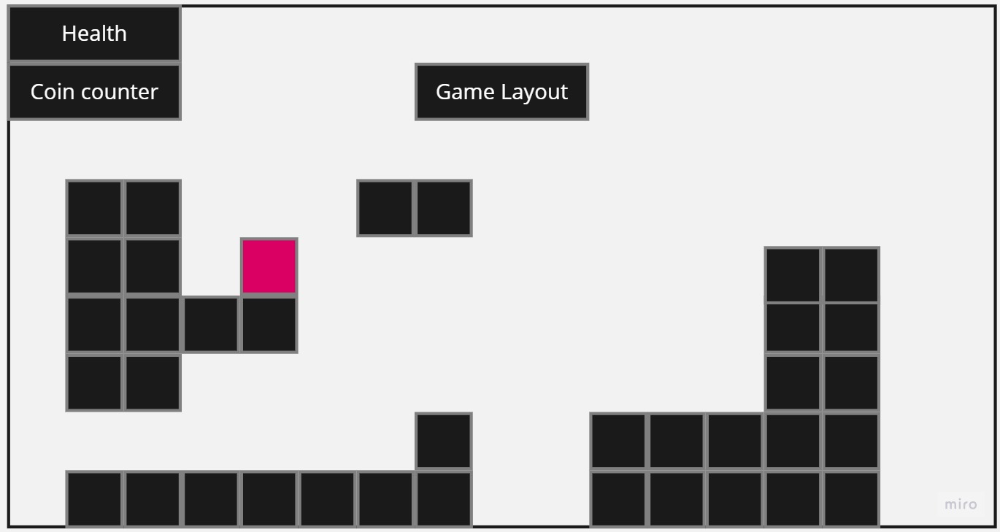

# Team 1 - Python course - Mid Term Project

Team members:
1. Abdullah Abu Hamad - Team Leader - The big orange cat
2. Amjad Alseyied - The moustache cat
3. Nawras Albibi - The Shawarma man
4. Mohammad AlGhanim - The tiger
5. Yazan Abu Shhab - Somebody that i used to know

presentation
[Link](https://docs.google.com/presentation/d/1tVQPjMPgKqLBXTwpZRNboJujDVOuZHeEAfj26BJT5b4/edit)

## Cooperation Plan
- Main Menu

- World Selector

- Game Level

- Describe at least:

1. What are the key strengths of each person on the team?
        Amjad - High technical
        Nawras - Fast learner
        Mohammad - Fast researcher
        Yazan - Out of the box thinker
2. How can you best utilize these strengths in the execution of your project?
        We have approached the first problem of finding a project by utilizing the key aspects of each personality.
        We have decided on distributing and studying the material needed for the project with minimal time.
3. In which professional competencies do you each want to develop greater strength?
        We wish to find the most suitable and fast way to figure out new ideas and implement the solutions within delivery time.
4. Knowing that every person in your team needs to understand all aspects of the project, how do you plan to approach the day-to-day work?
        The overall study of the project involves careful subject research and attention to assigned tasks and deliverables.

## Conflict Plan
- Your team should agree on a process for handing disagreements, should they arise. It is better to have a plan in place ahead of time so you can all refer back to it when necessary.

- Describe at least:

1. What will be your group’s process to resolve conflict, when it arises?
        Our team have high technical knowledge and great competency amonst other groups which will create some conflicts regarding code distribution and management.
        But we will initiate a plan which will involve management of the sections of the code distribution.

2. What will your team do if one person is taking over the project and not letting the other members contribute?
        Since there are assignments for each person we barely, have conflicts regarding contribution. But, if one arises a meeting shall be held to figure out the pace of the project.

3. How will you approach each other and the challenges of the project knowing that it is impossible for all members to be at the exact same place in understanding and skill level?
        We conduct meetings on Discord regularly and are present most of the project programming time, the time is managed so that personal life should not cross lines with project timeline, in these meetings we keep asking questions and check where each of the team members is at so that we can find the most appropriate method to research and help them.

4. How will you raise concerns to members who are not adequately contributing?
        By raising a concern to the assigned Teacher assistant or the Lead Lecturer to find a solution if simple communication was not effective.

5. How and when will you escalate the conflict if your resolution attempts are unsuccessful?
        We have a direct connection, so any report will be directed to the person in charge.

## Communication Plan

- Before beginning to tackle the project, determine how your group will communicate with each other. This is not an individual effort. Make sure everyone feels comfortable with the identified methods of speaking up.

- Describe at least:

1. What hours will you be available to communicate?
        We have a slack channel to communicate between members and visible to the TAs assigned, we raised a meeting prior to hand and as soon as everybody is informed, the meeting is a must.

2. What platforms will you use to communicate (ie. Slack, phone …)?
        Slack, Discord, WhatsApp

4. How often will you take breaks?
        We are time limited, but an 8 hour plan per day is more than enough to pursue our target.

5. What is your plan if you start to fall behind?
        At this point of agreement level, and management of the time, everything is in place, but if things go south, we reduce the outcome and find suitable solutions to finish within time.

6. How will you communicate after hours and on the weekend?
        Slack, Discord, WhatsApp

7. What is your strategy for ensuring everyone’s voice is heard?
        Everyone has a role to attend, and everyone will be given the opportunity to participate and pushed to participate.

8. How will you ensure that you are creating a safe environment where everyone feels comfortable speaking up?
        Encouraging new ideas, giving them tasks suitable for their creative levels and finding suitable tasks to make participants feel comfortable talking about achievements

## Work Plan

- Thursday: Initial meeting with project ideas
- Friday: Second meeting with study plans
- Saturday: Third meeting with plans on which library to work with on the project - PyGame
- Sunday: Start working on the code

## Git Process

- Each member shall import the project from the repository.
- Then create a personally nameed branch to push his work then the TL will merge will based on the work done.

